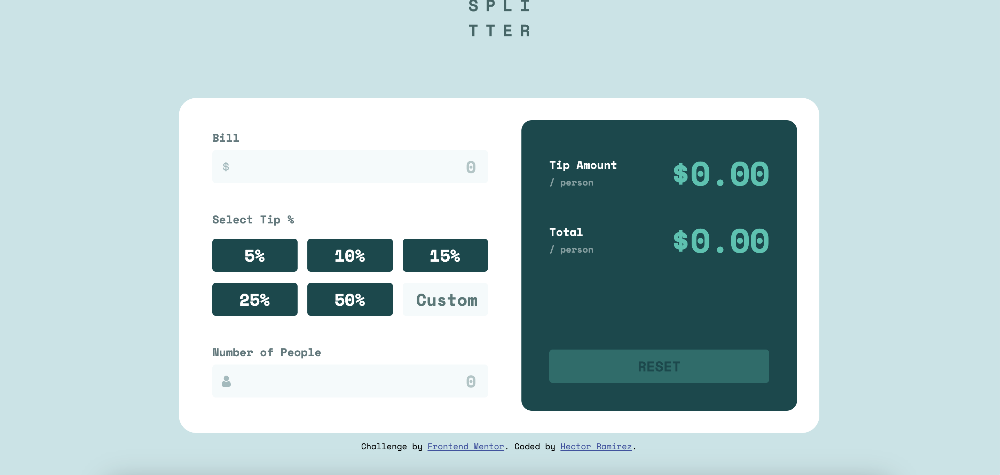
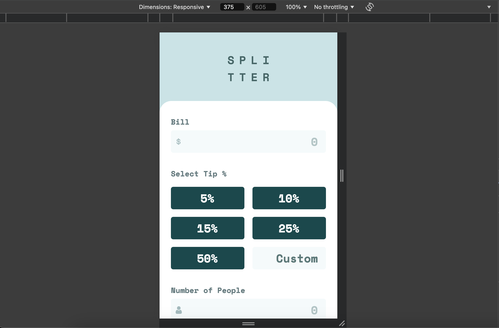

# Frontend Mentor - Tip calculator app solution

This is a solution to the [Tip calculator app challenge on Frontend Mentor](https://www.frontendmentor.io/challenges/tip-calculator-app-ugJNGbJUX). Frontend Mentor challenges help you improve your coding skills by building realistic projects.

## Table of contents

- [Overview](#overview)
  - [The challenge](#the-challenge)
  - [Screenshot](#screenshot)
  - [Links](#links)
- [My process](#my-process)
  - [Built with](#built-with)
  - [What I learned](#what-i-learned)
  - [Continued development](#continued-development)
  - [Useful resources](#useful-resources)
- [Author](#author)

## Overview

### The challenge

Users should be able to:

- View the optimal layout for the app depending on their device's screen size
- See hover states for all interactive elements on the page
- Calculate the correct tip and total cost of the bill per person

### Screenshot




### Links

- Solution URL: [Solution URL here](https://github.com/hectorlil48/tip-calculator-app)
- Live Site URL: [Live site URL here](https://hectorlil48.github.io/tip-calculator-app/)

## My process

### Built with

- Semantic HTML5 markup
- CSS custom properties
- Flexbox
- CSS Grid
- Mobile-first workflow
- JavaScript

### What I learned

I successfully used display: grid to ensure that the buttons and input fields are uniformly sized and perfectly aligned. This approach simplifies the layout and improves responsiveness, making the design more consistent and visually appealing. I learned a lot and adding color to placeholder text had me lost for a while. But I was able to figure it out. Figureing out the javascript for this project had me a little lost but I was able to break everything down and make functions for what I need to be done.

```html
<label for="select-tip">Select Tip %</label>
<div class="tip-grid">
  <button class="tip-btn" data-tip="5">5%</button>
  <button class="tip-btn" data-tip="10">10%</button>
  <button class="tip-btn" data-tip="15">15%</button>
  <button class="tip-btn" data-tip="25">25%</button>
  <button class="tip-btn" data-tip="50">50%</button>
  <input type="number" placeholder="Custom" id="customTip" />
</div>
```

```css
.tip-grid input::placeholder {
  color: var(--custom-grayish);
}
```

```js
const peopleValue = parseFloat(peopleInput.value); // Safely get the value
const tipAmountPerPerson = (billValue * (tipPercentage / 100)) / peopleValue;
const totalPerPerson = billValue / peopleValue + tipAmountPerPerson;

tipAmountDisplay.textContent = `$${tipAmountPerPerson.toFixed(2)}`;
totalAmountDisplay.textContent = `$${totalPerPerson.toFixed(2)}`;
```

### Continued development

As a web developer, I know I still have a lot to learn, especially in areas like CSS and JavaScript. I'm committed to continuing my journey by building more websites and sharpening my skills through hands-on practice. With each project, I aim to get better and more confident in my abilities.

### Useful resources

- [MDN](https://developer.mozilla.org/en-US/) - MDN is always useful. I was able to get a refresher of the display grid. I learned how to set up my columns and rows.
- [Google](https://www.google.com) - Google is helpful in many ways. I usually ask Google how to do something and it returns many links to help me. It also has a good AI feature that returns good answers. Google helped me understand a lot of Javascript methods.

## Author

- GitHub - [Hector Ramirez](https://github.com/hectorlil48)
- Frontend Mentor - [@hectorlil48](https://www.frontendmentor.io/profile/hectorlil48)
- LinkedIn - [@linkedin.com/in/hector-ramirez-6a6509170](https://www.linkedin.com/in/hector-ramirez-6a6509170/overlay/contact-info/)
